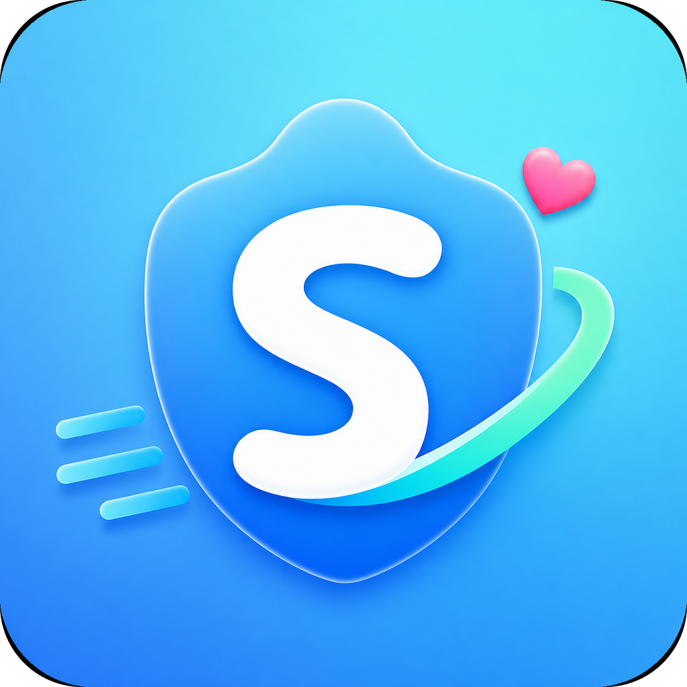

# XBClient

面向 [Xboard](https://github.com/cedar2025/Xboard) 的 Android、Windows、Linux 客户端。

登录面板账号后即可同步节点、套餐和流量；连接、分流和 TUN 由 [Aerion](https://github.com/MoeclubM/Aerion) 内核处理，和服务端 [NodeRS](https://github.com/MoeclubM/NodeRS) 使用同一套协议实现。

  

## 特性

- **面板一体**：登录 / 注册 / 第三方登录，套餐购买与兑换，工单，流量记录，邀请返利，站点公告。
- **节点即用**：自动同步订阅节点，支持延迟测试，一键连接。
- **TUN 与分流**：全局或规则分流（Clash / Mihomo YAML）；Android 可按应用黑白名单；桌面端可接管系统代理。
- **协议齐全**：AnyTLS、Hysteria2、Trojan、VLESS、VMess、Mieru、Naive、TUIC、Shadowsocks，以及 HTTP / SOCKS5、直连 / 阻断。
- **多平台**：Android 使用系统 VPN；Windows / Linux 提供托盘、静默启动和应用内更新。
- **多语言**：中文、英语、日语、俄语、波斯语，可跟随系统。

应用名、包名、站点地址和 API 在发布时注入，仓库里不存放默认品牌信息。你拿到的安装包会直接指向对应的 Xboard 站点。

## 平台

| 平台 | 安装包 | 连接方式 |
| --- | --- | --- |
| Android | arm64 APK | 系统 VPN（`VpnService`） |
| Windows | 安装包 | TUN（需管理员）或系统代理 |
| Linux | deb（x64 / arm64） | TUN 或系统代理 |

## 使用教程

### 1. 安装

到 [Releases](https://github.com/MoeclubM/XBClient/releases) 下载对应平台的安装包：

- Android：安装 APK，按系统提示允许安装未知来源（如需要）。
- Windows：运行安装程序。使用 TUN 时请右键「以管理员身份运行」。
- Linux：安装 deb 后，TUN 需要能访问 `/dev/net/tun`。

### 2. 登录

打开应用，用面板邮箱和密码登录；站点若开启了第三方登录，也可以走 OAuth。没有账号可以在应用内注册（邀请码按站点要求填写）。

登录后会同步套餐、流量和节点。没有有效套餐时，先到「套餐」页购买、兑换或重置流量。

### 3. 连接

1. 在节点列表里选择一个节点，需要时先点「测试」看延迟。
2. 点「连接」。Android 首次会请求 VPN 权限，请允许。
3. 状态变为「已连接」后即可使用。桌面端默认可以打开系统代理；需要全局接管网卡时再打开 TUN。

### 4. 分流（可选）

- **规则分流**：订阅若带了 Clash / Mihomo `rules`，连接时会按规则走代理或直连。也可以在设置里粘贴自定义 YAML。
- **应用分流（仅 Android）**：白名单只让选中的 App 走节点，黑名单则让选中的 App 直连。
- **DNS / IPv6**：可在设置中指定节点解析 DNS、代理 DNS、直连 DNS，以及 Fake-IP 或 IPv6。

### 5. 更新

应用内发现新版本时，可直接下载安装，或打开 Release 页面手动更新。

## 相关项目

- [Aerion](https://github.com/MoeclubM/Aerion) — 协议、路由与 TUN 核心
- [NodeRS](https://github.com/MoeclubM/NodeRS) — Xboard 机器节点
- [Xboard](https://github.com/cedar2025/Xboard) — 面板

能力细节见 [Aerion](https://github.com/MoeclubM/Aerion)。自行编译安装包时，品牌、签名和站点配置说明见 [docs/build.md](docs/build.md)。

## 许可

Apache License 2.0。见 [LICENSE](LICENSE)、[NOTICE](NOTICE) 与应用内「开源许可」页。
